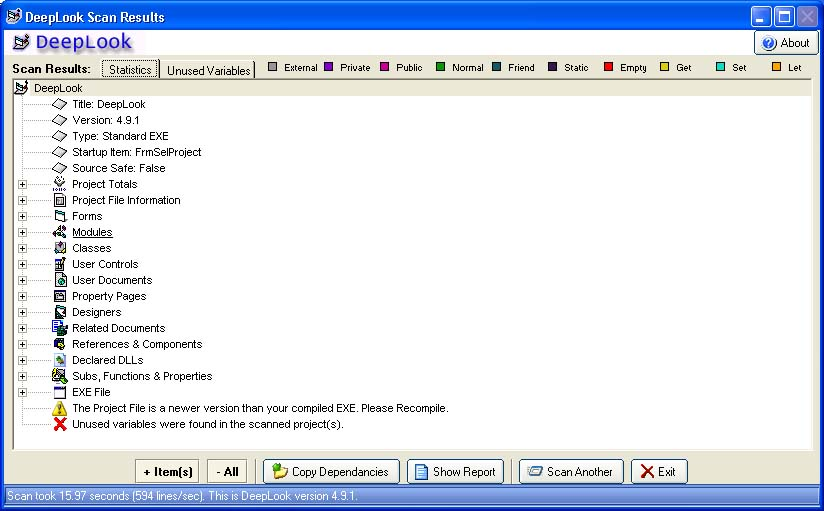



## DeepLook 4\.9

### Description

DeepLook project analysing software. I have now moved onto embedded microcontrollers and the C language so I will not be updating this project any further, unless problems are found by users.

DeepLook can scan and give reports for group, project or single VB files written in VB6, VB5 and (limited information) .NET. It shows all returned information in an easy to navigate Treeview and (for found unused variables) grid.

Please vote and comments on the final version of this software are most definetly welcome.

----

UPDATE: A new version is avaliable on PSC, this is kept because it has a shiny gold logo.
 
### More Info
 

             |
---                |---
**Submitted On**   |2005-03-04 16:16:54
**By**             |[Dean Camera](https://github.com/Planet-Source-Code/PSCIndex/blob/master/ByAuthor/dean-camera.md)
**Level**          |Intermediate
**User Rating**    |4.9 (247 globes from 50 users)
**Compatibility**  |VB 6\.0
**Category**       |[Complete Applications](https://github.com/Planet-Source-Code/PSCIndex/blob/master/ByCategory/complete-applications__1-27.md)
**World**          |[Visual Basic](https://github.com/Planet-Source-Code/PSCIndex/blob/master/ByWorld/visual-basic.md)
**Archive File**   |[DeepLook\_F186078342005\.zip](https://github.com/Planet-Source-Code/dean-camera-deeplook-4-9__1-59297/archive/master.zip)

